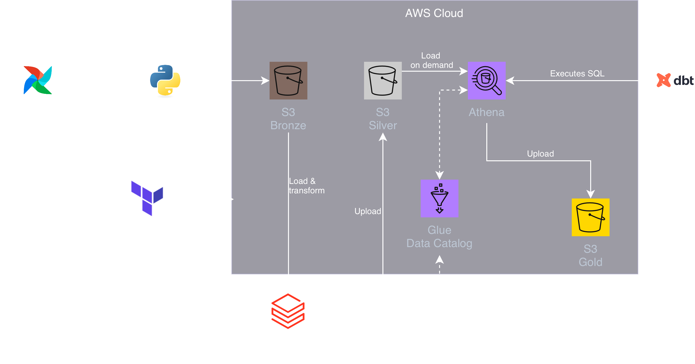

# GitTrends Data Pipeline

[](https://www.python.org/) [](https://airflow.apache.org/) [](https://www.databricks.com/) [](https://www.getdbt.com/) [](https://aws.amazon.com/) [](https://aws.amazon.com/s3/) [](https://www.terraform.io/) [](https://github.com/features/actions)

## 📌 Project Overview
GitTrends is a scalable, end-to-end data pipeline designed to ingest, process, and analyze massive volumes of GitHub event data from [GHArchive](https://www.gharchive.org/). 

The project strictly follows the **Medallion Architecture (Bronze ➔ Silver ➔ Gold)** to guarantee data quality and reliability. It demonstrates modern DataOps practices, including Infrastructure as Code (IaC), robust data testing, and fully automated CI/CD pipelines.



## 🛠 Tech Stack & Architecture

* **Infrastructure as Code (IaC):** Terraform (managing AWS S3, Athena, IAM roles)
* **Data Orchestration:** Apache Airflow (Dockerized)
* **Ingestion (Bronze):** Python (`requests`, `boto3`)
* **Processing (Silver):** PySpark / Databricks (Data flattening, Delta Lake formatting)
* **Data Modeling (Gold):** dbt (dbt-athena) for dimensional modeling (Star Schema)
* **Package Management:** `uv` (Ultra-fast Python environment manager)
* **Testing & CI/CD:** Pytest (with local Spark sessions), dbt tests (generic & singular), GitHub Actions

## 🌟 Key Features

* **Medallion Architecture:** Clear separation of raw data (Bronze), cleaned/parsed data (Silver), and business-level dimensional models (Gold).
* **Data Quality Assured:** Enforced data integrity using `dbt` singular tests (e.g., volume anomaly detection, chronological assertions) and generic schema tests.
* **Cost-Optimized CI/CD:** Automated GitHub Actions pipeline that isolates test data (`gittrends_gold_ci`), preventing accidental overwrites to the production data warehouse.
* **Local Spark Testing:** High-speed, cost-free unit testing for PySpark transformations using a localized JVM fixture via `pytest`.
* **Reproducible Environments:** Fully automated local setup using a centralized `Makefile` and `uv` package manager.

## 📂 Repository Structure

```text
.
├── airflow/                # Airflow DAGs and Docker Compose configuration
├── dbt/gittrends_dbt/      # dbt project (Models, Macros, and Singular Tests)
├── src/gittrends/          # Core Python package
│   ├── ingestion/          # API connectors and S3 upload logic
│   └── databricks/         # PySpark transformation scripts (Bronze to Silver)
├── terraform/              # Terraform configurations for AWS infrastructure
├── tests/                  # Pytest unit tests and PySpark local fixtures
└── Makefile                # Centralized command runner for local development

```

## 🚀 Getting Started (Local Development)

### Prerequisites

* [uv](https://github.com/astral-sh/uv) installed
* **Java 17** (Required for local PySpark execution) or Databricks environment
* Docker & Docker Compose
* AWS Credentials configured (`~/.aws/credentials`)

### 1. Environment Setup

The project uses `Makefile` to simplify the developer experience. Clone the repository and run:

```bash
make upgrade-pip
make install-all

```

*This installs the project locally in editable mode alongside `dbt` and `pyspark` dependencies.*

### 2. Infrastructure Deployment

Provision the required AWS S3 buckets and Athena databases:

```bash
cd terraform
terraform init
make terraform-apply
```

### 3. Running the Pipeline

Start the Airflow orchestrator:

```bash
make airflow-up
```

Access the Airflow UI at `http://localhost:8080` to trigger the `gharchive_ingestion` DAG.

## 🧪 Testing Strategy

This project prioritizes high engineering standards through automated testing.

**1. Unit Testing (Python & PySpark)**
Run local Pytest suite to validate API logic and Silver-layer Spark transformations:

```bash
make test-spark

```

**2. Data Quality Testing (dbt)**
Validate the Gold layer against schema assertions and custom business logic (Singular Tests):

```bash
make dbt-tests-singular

```

## 🔄 Continuous Integration (CI/CD)

The repository is integrated with **GitHub Actions**. Every Pull Request to the `master` branch triggers a workflow that:

1. Provisions an Ubuntu runner with Java 17 and Python 3.12.
2. Installs dependencies using `uv` with cache enabled.
3. Executes the full `pytest` suite to ensure code integrity before deployment.